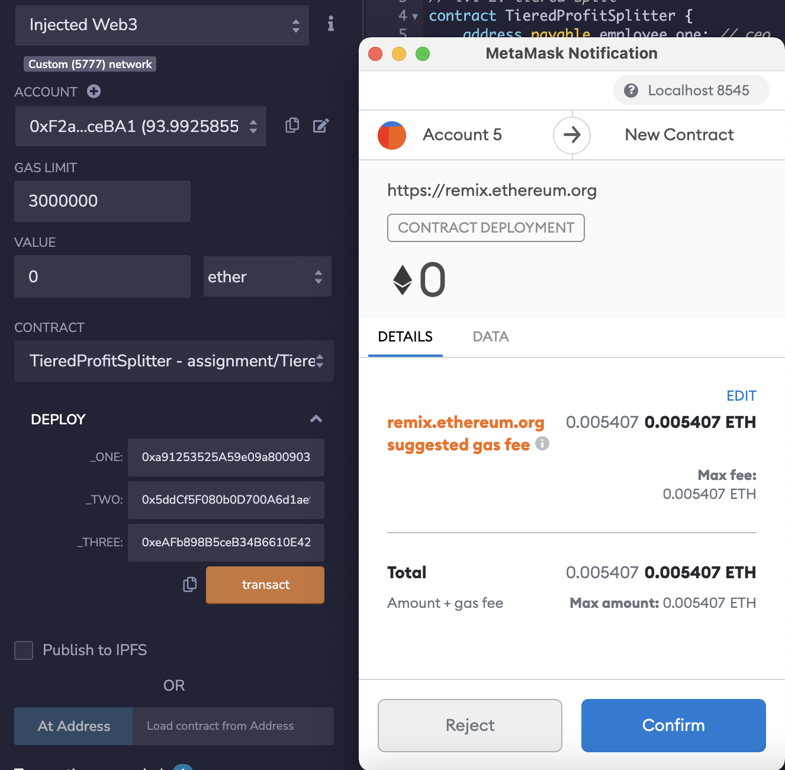
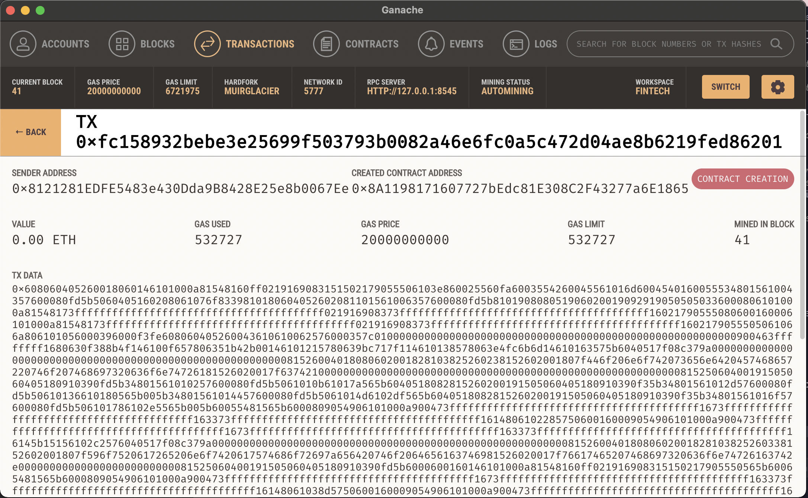

# Building smart contracts

## **AssociateProfitSplitter Contract**

This contract accept ether and divide it evenly among the associated employees. This contract allow the human resources department to remunerate the employees quickly and efficiently. 

### Testing the contract

Below is the balance before the transaction according to the associate profit splitter.

Deploy using Solidity via metamask. Local Ganache chained by connecting to injected Web 3 and LocalHost 8545 as its network. 

Split deposit of 6 ether to associate beneficiaries. The reminder balance after the transaction is 0. 

Balance after the transaction can be confirmed as below. The equal amount of ether has been successfully allocated to each beneficiary. 

## **TieredProfitSplitter Contract**

In this contract, rather than splitting the profits between associate-level employees, rudimentary percentages for different tiers of employees (CEO, CTO, and Bob) has been set to distribute accordingly.

* For CEO, (employee_one), distribute points * 60.
* For CTO (employee_two), distribute points * 25.
* For Bob (employee_three), distribute points * 15.

### Testing the contract

Below is the balance before the transaction according to the tiered profit splitter.

Deploy using Solidity via metamask. Local Ganache chained by connecting to injected Web 3 and LocalHost 8545 as its network. 

10 ether has been distributed to the beneficiaries. 

Balance after the transaction can be confirmed as below. 10 ether has been successfully allocated according to the percentage proportion into the account of all beneficiaries. 

## **Deferred Equity Plan Contract**

This contract will manage an employee's "deferred equity incentive plan," in which 1000 shares will be distributed over four years i.e. 250 shares per year to the employee. No ether will be used in this contract, but stores and sets amounts that represent the number of distributed shares the employee owns, and enforcing the vetting periods automatically.

The contract is deployed using Solidity.

Below is the confirmation of block cration and the transaction on Ganache.

